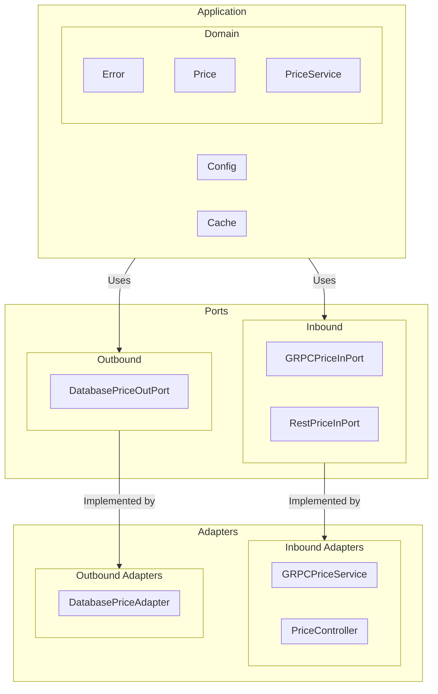
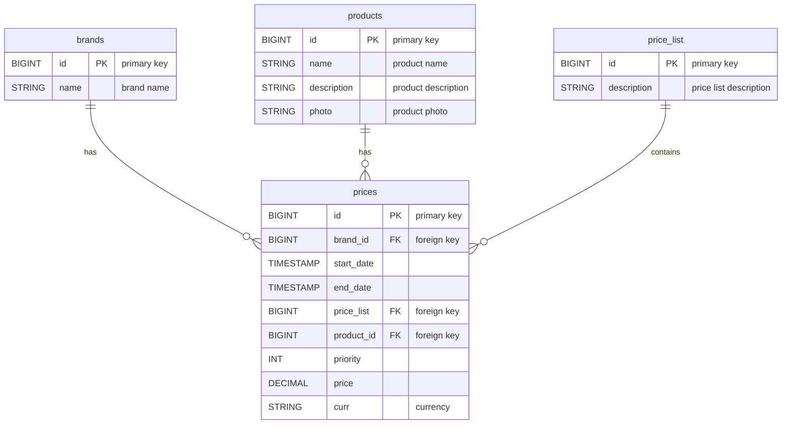

# Capitole Sisu Products API

A practical Spring Boot application demonstrating the implementation of a REST API to retrieve product prices
information from
a data source.

## Requirements

To run the application locally, you need:

- **JDK 21 or higher**
- **Maven 3.6 or higher**
- **Docker** (if you want to run the service in a container)

## Architecture

The architecture used in this project is Hexagonal Architecture (also known as Ports and Adapters).
This approach decouples the core business logic from the external systems, allowing for better testability and
maintainability.
The project is structured into different layers:

### Adapters

Adapters are responsible for interacting with external systems and frameworks. In this project, we have:

- `Inbound Adapters` (receiving input):
    - `PriceController` (inside `adapter.in.rest`): Manages RESTful API requests related to prices.
    - `GRPCPriceService` (inside `adapter.in.grpc`): Handles gRPC requests for prices services.
- `Outbound Adapters` (sending output):
    - `DatabasePriceAdapter` (inside `adapter.out`): Manages database queries for prices.

### Application Layer

This layer contains the business logic and service orchestration:

- `cache`: Logic for managing caching and its associated configurations.
- `config`: Configuration files.
- `service`: Contains any service domain logic.

### Domain Layer

The core of the system, where business entities and rules are defined:

- `error`: Handles domain-specific errors.
- `price`: Contains prices related domain models.

### Ports

Ports define the interfaces for communication between the core domain and external adapters. In this project, we have:

- `Inbound Ports` (used by adapters to interact with the application):
    - `RestPriceInPort` (inside `port.in.rest`): Defines REST-based interactions for prices.
    - `GRPCPriceInPort` (inside `port.in.rest`): Defines gRPC based interactions for prices.
- `Outbound Ports` (used by the application to communicate with external systems):
    - `DatabasePriceOutPort` (inside `port.out`): Defines interactions with database for prices.

### Diagram

Below is a diagram illustrating the Hexagonal Architecture used in this project:



## Running the Application (Manual)

1. Clone the repository:

   ```sh
   git clone https://github.com/edeldelgado90/capitole-sisu-products-api.git
   cd capitole-sisu-products-api
   ```
2. **Build the Project**:
    ```bash
    mvn clean install
    ```
3. **Run the application**:
    ```bash
    mvn spring-boot:run
    ```

## Running the Application (Docker)

1. Clone the repository:
   ```sh
   git clone https://github.com/edeldelgado90/capitole-sisu-products-api.git
   cd capitole-sisu-products-api
   ```
2. Build and run the Docker container:
   ```sh
   docker-compose up --build
   ```

## Accessing the OpenAPI Documentation

Once the application is running, you can access the OpenAPI documentation at:

[http://localhost:8080/swagger-ui.html](http://localhost:8080/swagger-ui.html)

This will allow you to explore and test the API endpoints.

## Database Information

The application inserts the following default data into the tables upon startup during the migration process:

### Brands

| id | name |
|----|------|
| 1  | ZARA |

### Products

| id    | name         | description                                                                                                    |
|-------|--------------|----------------------------------------------------------------------------------------------------------------|
| 35455 | JEANS MARINE | Jeans marine fit con cinturilla interior ajustable y cierre botón frontal. Bolsillos tipo plastrón en espalda. |

### Price List

| id | description                     |
|----|---------------------------------|
| 1  | Listado de Precios del 2020 - 1 |
| 2  | Listado de Precios del 2020 - 2 |
| 3  | Listado de Precios del 2020 - 3 |
| 4  | Listado de Precios del 2020 - 4 |

### Prices

| brand_id | start_date          | end_date            | price_list | product_id | priority | price | curr |
|----------|---------------------|---------------------|------------|------------|----------|-------|------|
| 1        | 2020-06-14 00:00:00 | 2020-12-31 23:59:59 | 1          | 35455      | 0        | 35.50 | EUR  |
| 1        | 2020-06-14 15:00:00 | 2020-06-14 18:30:00 | 2          | 35455      | 1        | 25.45 | EUR  |
| 1        | 2020-06-15 00:00:00 | 2020-06-15 11:00:00 | 3          | 35455      | 1        | 30.50 | EUR  |
| 1        | 2020-06-15 16:00:00 | 2020-12-31 23:59:59 | 4          | 35455      | 1        | 38.95 | EUR  |

## Database Schema Diagram

Below is a diagram representing the relationships between the tables using Mermaid syntax. You can render this using a
Mermaid-compatible viewer.



## REST API Endpoints

### Get Current Price

#### GET `/api/prices/current?product_id={id}&brand_id={id}&date={date}`

Curl Example:

```bash
curl -X GET http://localhost:8080/api/prices/current?product_id=35455&brand_id=1&date=2020-07-01T12:00:00 \
  -H "Content-Type: application/json"
```

### Get All Prices

#### GET `/api/prices/current?product_id={id}&brand_id={id}&date={date}`

Curl Example:

```bash
curl -X GET http://localhost:8080/api/prices/?page=0&size=10 \
 -H 'Accept-Encoding: application/json'
```

### Create a Price

#### POST `/api/prices`

Example Request Body:

```json
{
  "brandId": 1,
  "startDate": "2023-01-01T00:00:00",
  "endDate": "2023-12-31T23:59:59",
  "priceList": 1,
  "productId": 35455,
  "priority": 1,
  "price": 100.00,
  "curr": "EUR"
}
```

Curl Example:

```bash
curl -X POST http://localhost:8080/api/prices \
  -H "Content-Type: application/json" \
  -d '{
        "brandId": 1,
        "startDate": "2023-01-01T00:00:00",
        "endDate": "2023-12-31T23:59:59",
        "priceList": 1,
        "productId": 35455,
        "priority": 1,
        "price": 100.00,
        "curr": "EUR"
      }'
```

### Delete a Price

#### DELETE `/api/prices/{id}`

Curl Example:

```bash
curl -X DELETE http://localhost:8080/api/prices/1 \
  -H "Content-Type: application/json"
```

## gRPC Usage

To use gRPC, ensure you have grpcurl installed and use the following command to invoke the service:

```bash
grpcurl -plaintext -d '{
    "productId": 35455,
    "brandId": 1,
    "date": "2020-06-14T20:32:05Z"
}' localhost:9090 prices.PriceService/getCurrentPriceByProductAndBrand
```

## Running Tests

To run unit and integration tests:

```bash
mvn test
```